# AUDITORIA DO FLUXO REAL DO BAZARI ENGINE

**Data:** 2026-01-06
**Baseline:** `/home/bazari/engine/docs/architecture-flow.md`
**Método:** Leitura estática do código-fonte

---

## 1. DIAGRAMA MERMAID ATUALIZADO (FLUXO REAL)

```mermaid
flowchart TB
    subgraph ENTRY["1. CLI ENTRY"]
        CLI["main.py<br/>--project --input<br/>--input-mode --release"]
        CLI -->|"--idl-only"| IDL_ONLY["run_idl_only()<br/>IDL processing only"]
        CLI -->|"--release"| RELEASE_PATH["engine.run_release()"]
        CLI -->|"--skip-build"| ARTIFACTS_PATH["engine.run()<br/>skip_build=True"]
        CLI -->|"default"| BUILD_PATH["engine.run_with_build()"]
    end

    subgraph DISPATCH["2. INPUT DISPATCH"]
        direction TB
        DETECT["detect_input_mode_auto()"]

        DETECT -->|".idl file"| IDL_DIRECT["IDL Parser"]
        DETECT -->|".json + schema_version=idl.v1"| IDL_DIRECT
        DETECT -->|".json + schema_version=idl_draft.v1"| DRAFT_PATH2["Draft Path"]
        DETECT -->|"IDL keywords at start"| IDL_DIRECT
        DETECT -->|"other text"| NATURAL_PATH["Natural Path"]

        subgraph IDL_DISPATCH["IDL Dispatch"]
            IDL_DIRECT --> IDL_PARSE["parse_idl_v1()"]
            IDL_PARSE --> CONTRACT_GATE_IDL["Contract Gate<br/>save to IDL store"]
            CONTRACT_GATE_IDL --> IDL_DOC["IDLDocument"]
        end

        subgraph DRAFT_DISPATCH["Draft Dispatch"]
            DRAFT_PATH2 --> GATE1["GATE 1<br/>DraftSchemaValidator"]
            GATE1 -->|"FAIL"| GATE1_ERR["gate1_errors[]<br/>BLOCKED"]
            GATE1 -->|"OK"| GATE2["GATE 2<br/>compile_draft_to_idl()"]
            GATE2 -->|"open_questions"| GATE2_ERR["gate2_errors[]<br/>BLOCKED"]
            GATE2 -->|"OK"| CONTRACT_GATE_DRAFT["Contract Gate"]
            CONTRACT_GATE_DRAFT --> IDL_DOC
        end

        subgraph NATURAL_DISPATCH["Natural Dispatch"]
            NATURAL_PATH --> STUB["Create Stub Draft<br/>open_questions=True"]
            STUB --> GATE2_NAT["GATE 2<br/>ALWAYS BLOCKS"]
            GATE2_NAT --> NAT_BLOCKED["BLOCKED<br/>Manual conversion required"]
        end
    end

    subgraph INTAKE["3. INTAKE PHASE"]
        IDL_DOC --> NORM["Normalizer<br/>MAX_INPUT_SIZE=20000"]
        NORM --> CLASSIFY["BlueprintClassifier<br/>FORCED_GENERIC (v1)"]
        CLASSIFY --> REQ_ANALYST["RequirementsAnalyst"]

        subgraph MINIGRAMMAR["Mini-Grammar Parser"]
            REQ_ANALYST --> FORM_A["Form A: entity(fields)"]
            REQ_ANALYST --> FORM_B["Form B: cadastro de X com Y"]
            REQ_ANALYST --> FORM_C["Form C: entity: fields"]
            REQ_ANALYST --> FORM_D["Form D: fallback entity list"]
        end

        MINIGRAMMAR --> SRS_GEN["generate_srs()<br/>generation_mode=MINIGRAMMAR_V2"]
        SRS_GEN --> SRS_VAL["SRSValidatorGate.process()"]
        SRS_VAL -->|"FAIL"| SRS_QUESTIONS["Generate Questions<br/>max 7 per round<br/>BLOCKED"]
        SRS_VAL -->|"OK"| SRS["SRS v{N}.json"]
    end

    subgraph PROCESSING["4. PROCESSING PHASE"]
        SRS --> DOMAIN["DomainModeler.generate_ir()"]
        DOMAIN --> IR_VAL["IR Validator<br/>minItems: 1 entities"]
        IR_VAL -->|"entities=[]"| IR_BLOCKED["BLOCKED<br/>No entities"]
        IR_VAL -->|"OK"| IR_POLICY["PolicyValidator.validate()"]
        IR_POLICY -->|"FAIL"| IR_POL_ERR["policy_ok=False<br/>BLOCKED"]
        IR_POLICY -->|"OK"| IR["IR v{N}.json"]

        IR --> CONTRACTS["ContractsAgent.generate_contracts()"]
        CONTRACTS --> OAS_VAL["OpenAPIValidator"]
        CONTRACTS --> RBAC_VAL["RBACValidator"]
        OAS_VAL --> CONTRACTS_POLICY["PolicyValidator.validate_contracts()"]
        RBAC_VAL --> CONTRACTS_POLICY
        CONTRACTS_POLICY -->|"FAIL"| CONTRACTS_ERR["contracts_policy_ok=False<br/>BLOCKED"]
        CONTRACTS_POLICY -->|"OK"| OAS["OpenAPI v{N}.yaml"]
        CONTRACTS_POLICY -->|"OK"| RBAC["RBAC v{N}.json"]

        IR --> PLANNER["PlannerAgent.generate_plan()"]
        OAS --> PLANNER
        RBAC --> PLANNER
        PLANNER --> PLAN_VAL["PlanValidator"]
        PLAN_VAL --> PLAN_POLICY["PolicyValidator.validate_plan()"]
        PLAN_POLICY -->|"FAIL"| PLAN_ERR["plan_policy_ok=False<br/>BLOCKED"]
        PLAN_POLICY -->|"OK"| PLAN["PLAN v{N}.json<br/>strategy=PATCH_ONLY"]
    end

    subgraph STORE["5. ARTIFACT STORE"]
        SRS --> ARTIFACT_STORE[("ArtifactsStore<br/>{store_root}/{project}/")]
        IR --> ARTIFACT_STORE
        OAS --> ARTIFACT_STORE
        RBAC --> ARTIFACT_STORE
        PLAN --> ARTIFACT_STORE

        ARTIFACT_STORE --> RUN_LOG["RunLog<br/>{project}/runs/{exec_id}_{ts}.json<br/>hashes: input/srs/ir/oas/rbac/plan"]
    end

    subgraph REPO["6. REPO GENERATION"]
        PLAN --> REPO_GEN["RepoGenerator.create_repo()"]
        REPO_GEN --> TPL_COPY["Copy Templates"]
        TPL_COPY --> BACKEND["backend/<br/>spring-boot template"]
        TPL_COPY --> FRONTEND["frontend/<br/>react-vite template"]
        TPL_COPY --> DB["db/<br/>postgres-flyway template"]
        TPL_COPY --> DOCKER_YML["docker-compose.yml<br/>volume: postgres_data_{exec_id}"]

        BACKEND --> GEN_REPO["/home/bazari/generated/{project}/"]
        FRONTEND --> GEN_REPO
        DB --> GEN_REPO
        DOCKER_YML --> GEN_REPO
    end

    subgraph PATCH["7. PATCH ENGINE"]
        PLAN --> PATCH_GEN["PatchGenerator<br/>SLOT_MARKERS system"]
        PATCH_GEN --> PATCH_SET["PatchSet"]

        subgraph SECURITY["Security Guards"]
            PATCH_SET --> SEC_PATH["Path Validation<br/>No .. traversal"]
            SEC_PATH --> SEC_BLOCKED["Blocked Paths<br/>/engine/** /templates/**"]
            SEC_BLOCKED --> SEC_SIZE["Size Limit<br/>rewrite_ratio < 0.80"]
        end

        SECURITY -->|"FAIL"| PATCH_SEC_ERR["PatchSecurityError<br/>BLOCKED"]
        SECURITY -->|"OK"| APPLY_PATCH["PatchEngine.apply_patches()"]
        APPLY_PATCH -->|"FAIL"| PATCH_ROLLBACK["Atomic Rollback<br/>Restore from backup"]
        APPLY_PATCH -->|"OK"| PATCHED_REPO["Patched Repo"]
    end

    subgraph BUILD["8. BUILD VALIDATION"]
        PATCHED_REPO --> BUILD_VAL["BuildValidator.validate()"]
        BUILD_VAL --> NPM["FRONTEND<br/>npm ci (180s) + npm run build (300s)"]
        BUILD_VAL --> MVN["BACKEND<br/>mvn test (300s)"]
        NPM --> BUILD_REPORT{"BuildReport"}
        MVN --> BUILD_REPORT
        BUILD_REPORT -->|"ok=True"| BUILD_OK["build_ok=True"]
        BUILD_REPORT -->|"ok=False"| FIX_CHECK{"enable_fix_loop?"}
    end

    subgraph FIXLOOP["9. FIX LOOP"]
        FIX_CHECK -->|"False"| FIX_DISABLED["final_status=build_failed"]
        FIX_CHECK -->|"True"| FIX_AGENT["FixLoopAgent<br/>MAX_FIX_ATTEMPTS=3"]

        FIX_AGENT --> ERR_CLASS["ErrorClassifier<br/>BuildErrorType enum"]
        ERR_CLASS --> FIX_GEN["FixPatchGenerator"]
        FIX_GEN --> FIX_APPLY["PatchEngine.apply_patches()"]
        FIX_APPLY --> FIX_BUILD["BuildValidator.validate()"]
        FIX_BUILD -->|"OK"| FIX_SUCCESS["final_status=fixed"]
        FIX_BUILD -->|"FAIL"| FIX_RETRY{"attempt < 3?"}
        FIX_RETRY -->|"Yes"| FIX_AGENT
        FIX_RETRY -->|"No"| FIX_EXHAUSTED["final_status=build_failed<br/>aborted_reason set"]
    end

    subgraph RELEASE["10. RELEASE PHASE"]
        BUILD_OK --> DOCKER_VAL["DockerComposeValidator"]
        FIX_SUCCESS --> DOCKER_VAL

        DOCKER_VAL --> ENSURE_VALID["ensure_valid()<br/>Check services: postgres, backend, frontend"]
        ENSURE_VALID -->|"FAIL"| DOCKER_INVALID["DOCKER_UP_FAILED"]
        ENSURE_VALID -->|"OK"| VALIDATE_CTX["validate_build_contexts()<br/>Check Dockerfiles exist"]
        VALIDATE_CTX -->|"FAIL"| CTX_INVALID["DOCKER_UP_FAILED"]
        VALIDATE_CTX -->|"OK"| COMPOSE_UP["test_docker_compose_up()<br/>docker compose up -d<br/>timeout=300s"]
        COMPOSE_UP -->|"FAIL"| COMPOSE_FAIL["DOCKER_UP_FAILED<br/>Collect docker_ps, logs"]
        COMPOSE_UP -->|"OK"| WAIT_READY["wait_for_readiness()<br/>timeout=120s, poll=2s<br/>fingerprint=DCV_FINGERPRINT_20260105_B"]
        WAIT_READY -->|"FAIL"| READY_FAIL["collect_runtime_evidence()<br/>SMOKE_FAILED"]
        WAIT_READY -->|"OK"| SMOKE["SmokeRunner.run_smoke_tests()<br/>timeout=30s per test"]
        SMOKE -->|"FAIL"| SMOKE_FAIL["SMOKE_FAILED"]
        SMOKE -->|"OK"| RUNNING["final_status=running<br/>services_running=[]"]
    end

    subgraph ROLLBACK["11. ROLLBACK"]
        DOCKER_INVALID --> ROLLBACK_ACTION
        CTX_INVALID --> ROLLBACK_ACTION
        COMPOSE_FAIL --> STOP_SERVICES["DockerComposeValidator.stop_services()"]
        READY_FAIL --> STOP_SERVICES
        SMOKE_FAIL --> STOP_SERVICES
        STOP_SERVICES --> ROLLBACK_ACTION["_rollback_release()"]

        ROLLBACK_ACTION --> MOVE_FAILED["RepoGenerator.move_to_failed()<br/>_failed/{CATEGORY}/{timestamp}/"]
        MOVE_FAILED --> EVIDENCE["RuntimeEvidenceCollector<br/>docker ps, logs, events"]
        EVIDENCE --> DIAG_REPORT["DiagnosticReport<br/>schema_version=diagnostic_report.v1<br/>content_hash SHA256"]
    end

    subgraph OUTCOMES["12. FINAL OUTCOMES"]
        RUNNING --> SUCCESS["RunResult<br/>success=True<br/>release_mode=True"]
        FIX_DISABLED --> FAIL_RESULT["RunResult<br/>success=False"]
        FIX_EXHAUSTED --> FAIL_RESULT
        DIAG_REPORT --> FAIL_RESULT
        NAT_BLOCKED --> FAIL_RESULT
        GATE1_ERR --> FAIL_RESULT
        GATE2_ERR --> FAIL_RESULT
        SRS_QUESTIONS --> FAIL_RESULT
        IR_BLOCKED --> FAIL_RESULT
        IR_POL_ERR --> FAIL_RESULT
        CONTRACTS_ERR --> FAIL_RESULT
        PLAN_ERR --> FAIL_RESULT
        PATCH_SEC_ERR --> FAIL_RESULT
    end

    %% Styling
    classDef entry fill:#e1f5fe,stroke:#01579b
    classDef dispatch fill:#f3e5f5,stroke:#4a148c
    classDef intake fill:#e8f5e9,stroke:#1b5e20
    classDef processing fill:#fff3e0,stroke:#e65100
    classDef store fill:#fce4ec,stroke:#880e4f
    classDef repo fill:#e0f2f1,stroke:#004d40
    classDef patch fill:#fff8e1,stroke:#ff6f00
    classDef build fill:#e3f2fd,stroke:#0d47a1
    classDef fixloop fill:#ffebee,stroke:#b71c1c
    classDef release fill:#f1f8e9,stroke:#33691e
    classDef rollback fill:#ffcdd2,stroke:#c62828
    classDef outcomes fill:#e8eaf6,stroke:#1a237e
    classDef blocked fill:#ff8a80,stroke:#d50000
    classDef gate fill:#b39ddb,stroke:#4527a0

    class CLI,IDL_ONLY,RELEASE_PATH,ARTIFACTS_PATH,BUILD_PATH entry
    class DETECT,IDL_DIRECT,DRAFT_PATH2,NATURAL_PATH,IDL_PARSE,CONTRACT_GATE_IDL,IDL_DOC,GATE1,GATE2,CONTRACT_GATE_DRAFT,STUB,GATE2_NAT dispatch
    class NORM,CLASSIFY,REQ_ANALYST,FORM_A,FORM_B,FORM_C,FORM_D,SRS_GEN,SRS_VAL,SRS intake
    class DOMAIN,IR_VAL,IR_POLICY,IR,CONTRACTS,OAS_VAL,RBAC_VAL,CONTRACTS_POLICY,OAS,RBAC,PLANNER,PLAN_VAL,PLAN_POLICY,PLAN processing
    class ARTIFACT_STORE,RUN_LOG store
    class REPO_GEN,TPL_COPY,BACKEND,FRONTEND,DB,DOCKER_YML,GEN_REPO repo
    class PATCH_GEN,PATCH_SET,SEC_PATH,SEC_BLOCKED,SEC_SIZE,APPLY_PATCH,PATCHED_REPO patch
    class BUILD_VAL,NPM,MVN,BUILD_REPORT,BUILD_OK build
    class FIX_CHECK,FIX_DISABLED,FIX_AGENT,ERR_CLASS,FIX_GEN,FIX_APPLY,FIX_BUILD,FIX_SUCCESS,FIX_RETRY,FIX_EXHAUSTED fixloop
    class DOCKER_VAL,ENSURE_VALID,VALIDATE_CTX,COMPOSE_UP,WAIT_READY,SMOKE,RUNNING release
    class ROLLBACK_ACTION,STOP_SERVICES,MOVE_FAILED,EVIDENCE,DIAG_REPORT rollback
    class SUCCESS,FAIL_RESULT outcomes
    class NAT_BLOCKED,GATE1_ERR,GATE2_ERR,SRS_QUESTIONS,IR_BLOCKED,IR_POL_ERR,CONTRACTS_ERR,PLAN_ERR,PATCH_SEC_ERR,DOCKER_INVALID,CTX_INVALID,COMPOSE_FAIL,READY_FAIL,SMOKE_FAIL,PATCH_ROLLBACK blocked
    class GATE1,GATE2,GATE2_NAT,CONTRACT_GATE_IDL,CONTRACT_GATE_DRAFT gate
```



---

## 2. NODE → EVIDENCE MAP

### 2.1 Entry Points

| Node | File | Function/Method | Line | Notes |
|------|------|-----------------|------|-------|
| `CLI` | `main.py` | `parse_args()` | 50-131 | Argumentos: --project, --input, --input-mode, --release, --skip-build, --idl-only |
| `run_idl_only()` | `main.py` | `run_idl_only()` | 204-285 | Modo IDL-only sem pipeline completo |
| `engine.run_release()` | `orchestrator/engine.py` | `Engine.run_release()` | 903-1167 | Modo release com docker/smoke |
| `engine.run_with_build()` | `orchestrator/engine.py` | `Engine.run_with_build()` | 664-848 | Build com fix loop opcional |
| `engine.run()` | `orchestrator/engine.py` | `Engine.run()` | 328-585 | Geração de artefatos apenas |

### 2.2 Input Dispatch

| Node | File | Function/Method | Line | Notes |
|------|------|-----------------|------|-------|
| `detect_input_mode_auto()` | `orchestrator/input_mode.py` | `detect_input_mode_auto()` | 53-101 | Detecção: .idl → extensão, .json → schema_version, keywords → IDL |
| `InputMode` enum | `orchestrator/input_mode.py` | `class InputMode` | 20-25 | Values: NATURAL, DRAFT, IDL, AUTO |
| `InputDispatcher` | `orchestrator/input_dispatcher.py` | `class InputDispatcher` | 88-433 | dispatch() method: lines 108-173 |
| `_dispatch_idl()` | `orchestrator/input_dispatcher.py` | `_dispatch_idl()` | 175-256 | IDL parse + Contract Gate |
| `_dispatch_draft()` | `orchestrator/input_dispatcher.py` | `_dispatch_draft()` | 258-340 | GATE 1 + GATE 2 + Contract Gate |
| `_dispatch_natural()` | `orchestrator/input_dispatcher.py` | `_dispatch_natural()` | 342-409 | Always blocks with open_questions |
| `GATE 1` | `orchestrator/input_dispatcher.py` | `DraftSchemaValidator.validate()` | ~280 | Validação estrutural do Draft |
| `GATE 2` | `orchestrator/input_dispatcher.py` | `compile_draft_to_idl()` | ~300 | Compilação Draft→IDL, bloqueia se open_questions |

### 2.3 Intake Phase

| Node | File | Function/Method | Line | Notes |
|------|------|-----------------|------|-------|
| `Normalizer` | `intake/normalizer.py` | `Normalizer.normalize()` | 47-81 | MAX_INPUT_SIZE=20000, trim, dedupe spaces |
| `BlueprintClassifier` | `intake/blueprint_classifier.py` | `BlueprintClassifier.classify()` | 52-70 | FORCED_GENERIC, confidence=0.0 |
| `RequirementsAnalyst` | `intake/req_analyst.py` | `class RequirementsAnalyst` | 1-1247 | Mini-grammar 4 formas |
| `Form A` | `intake/req_analyst.py` | `parse_form_a()` | 391-418 | Pattern: `entity(field1, field2)` |
| `Form B` | `intake/req_analyst.py` | `parse_form_b()` | 421-446 | Pattern: `cadastro de X com Y, Z` |
| `Form C` | `intake/req_analyst.py` | `parse_form_c()` | 449-478 | Pattern: `entity: field1, field2` |
| `Form D` | `intake/req_analyst.py` | `parse_form_d()` | 481-539 | Fallback: entity list sem campos |
| `generate_srs()` | `intake/req_analyst.py` | `RequirementsAnalyst.generate_srs()` | 1086-1186 | generation_mode=MINIGRAMMAR_V2 |
| `SRSValidatorGate` | `validators/srs_validator.py` | `SRSValidatorGate.process()` | 170-188 | Returns (can_proceed, srs, questions) |

### 2.4 Processing Phase

| Node | File | Function/Method | Line | Notes |
|------|------|-----------------|------|-------|
| `DomainModeler` | `agents/domain_modeler.py` | `DomainModeler.generate_ir()` | 15-33 | SRS → IR determinístico |
| `IR Validator` | `validators/ir_validator.py` | `validate_ir()` | - | Schema validation, minItems:1 entities |
| `PolicyValidator (IR)` | `validators/policy_validator.py` | `PolicyValidator.validate()` | - | api_intent.resources match entities |
| `ContractsAgent` | `agents/contracts_agent.py` | `ContractsAgent.generate_contracts()` | 23-41 | IR → (OpenAPI, RBAC) |
| `OpenAPIValidator` | `validators/openapi_validator.py` | `validate_openapi()` | - | OpenAPI 3.0 schema |
| `RBACValidator` | `validators/rbac_validator.py` | `validate_rbac()` | - | Roles/permissions structure |
| `PolicyValidator (Contracts)` | `validators/policy_validator.py` | `validate_contracts()` | - | Op/permission mapping |
| `PlannerAgent` | `agents/planner_agent.py` | `PlannerAgent.generate_plan()` | 29-67 | strategy=PATCH_ONLY |
| `PlanValidator` | `validators/plan_validator.py` | `validate_plan()` | - | Tasks structure |
| `PolicyValidator (PLAN)` | `validators/policy_validator.py` | `validate_plan()` | - | Task/op coverage |

### 2.5 Artifact Store

| Node | File | Function/Method | Line | Notes |
|------|------|-----------------|------|-------|
| `ArtifactsStore` | `store/artifacts_store.py` | `class ArtifactsStore` | 10-200+ | {store_root}/{project}/{KIND}/v{N}.{ext} |
| `next_version()` | `store/artifacts_store.py` | `next_version()` | 78-91 | Auto-increment vN |
| `save_artifact()` | `store/artifacts_store.py` | `save_artifact()` | 93-119 | UTF-8, JSON indent=2 |
| `write_run_log()` | `store/artifacts_store.py` | `write_run_log()` | 164-200+ | {project}/runs/{exec_id}_{ts}.json |
| `_compute_hash()` | `orchestrator/engine.py` | `Engine._compute_hash()` | 592-594 | SHA256[:16] |

### 2.6 Repo Generation & Patch Engine

| Node | File | Function/Method | Line | Notes |
|------|------|-----------------|------|-------|
| `RepoGenerator` | `repo/repo_generator.py` | `class RepoGenerator` | 24-196+ | TEMPLATE_MAPPING: spring-boot→backend, react-vite→frontend |
| `create_repo()` | `repo/repo_generator.py` | `create_repo()` | 57-104 | Volume: postgres_data_{exec_id} |
| `ReleaseFailureCategory` | `repo/repo_generator.py` | `class ReleaseFailureCategory` | 11-21 | BUILD_FAILED, DOCKER_UP_FAILED, SMOKE_FAILED, POLICY_FAILED, UNKNOWN_RELEASE_FAILED |
| `move_to_failed()` | `repo/repo_generator.py` | `move_to_failed()` | - | _failed/{CATEGORY}/{timestamp}/ |
| `PatchEngine` | `patch_engine/patch_engine.py` | `class PatchEngine` | 74-190+ | Security guards |
| `_validate_path()` | `patch_engine/patch_engine.py` | `_validate_path()` | 192-200+ | No .. allowed |
| `BLOCKED_PATHS` | `patch_engine/patch_engine.py` | constant | - | /engine/**, /templates/** |
| `max_rewrite_ratio` | `patch_engine/patch_engine.py` | parameter | - | 0.80 (80% max) |
| `apply_patches()` | `patch_engine/patch_engine.py` | `apply_patches()` | ~500+ | Returns PatchResult |
| `SLOT_MARKERS` | `compilers/patch_generator_v1.py` | constant | - | @engine:{name}:start/end |

### 2.7 Build Validation & Fix Loop

| Node | File | Function/Method | Line | Notes |
|------|------|-----------------|------|-------|
| `BuildValidator` | `validators/build_validator.py` | `class BuildValidator` | 72-150+ | validate() method |
| `DEFAULT_TIMEOUT` | `validators/build_validator.py` | constant | - | 300s |
| `NPM_CI_TIMEOUT` | `validators/build_validator.py` | constant | - | 180s |
| `MVN_TIMEOUT` | `validators/build_validator.py` | constant | - | 300s |
| `BuildComponent` | `validators/build_validator.py` | enum | - | BACKEND, FRONTEND, ALL |
| `FixLoopAgent` | `fix_loop/fix_loop_agent.py` | `class FixLoopAgent` | 114-150+ | run() method |
| `MAX_FIX_ATTEMPTS` | `fix_loop/fix_loop_agent.py` | constant | 126 | 3 |
| `ErrorClassifier` | `fix_loop/error_classifier.py` | `class ErrorClassifier` | - | BuildErrorType enum |
| `BuildErrorType` | `fix_loop/error_classifier.py` | enum | - | JAVA_*, SQL_*, TS_*, UNKNOWN_BUT_PATCHABLE, FATAL_UNCLASSIFIED |

### 2.8 Release Phase

| Node | File | Function/Method | Line | Notes |
|------|------|-----------------|------|-------|
| `DockerComposeValidator` | `release/docker_compose_validator.py` | `class DockerComposeValidator` | 127-150+ | REQUIRED_SERVICES: postgres, backend, frontend |
| `DOCKER_UP_TIMEOUT` | `release/docker_compose_validator.py` | constant | - | 300s |
| `ensure_valid()` | `release/docker_compose_validator.py` | `ensure_valid()` | ~200+ | Check docker-compose.yml structure |
| `validate_build_contexts()` | `release/docker_compose_validator.py` | `validate_build_contexts()` | ~300+ | Check Dockerfiles exist |
| `test_docker_compose_up()` | `release/docker_compose_validator.py` | `test_docker_compose_up()` | ~400+ | docker compose up -d |
| `wait_for_readiness()` | `release/docker_compose_validator.py` | `wait_for_readiness()` | ~500+ | timeout=120s, poll=2s |
| `readiness_fingerprint` | `orchestrator/engine.py` | constant | 733 | DCV_FINGERPRINT_20260105_B |
| `SmokeRunner` | `release/smoke_runner.py` | `class SmokeRunner` | 109-150+ | DEFAULT_TIMEOUT=30s |
| `run_smoke_tests()` | `release/smoke_runner.py` | `run_smoke_tests()` | 148+ | Backend healthcheck + CRUD, Frontend render |
| `RuntimeEvidenceCollector` | `release/runtime_evidence_collector.py` | `collect_runtime_evidence()` | ~100+ | docker ps, logs, events |
| `DiagnosticReport` | `release/diagnostic_report.py` | module | - | schema_version=diagnostic_report.v1 |
| `DIAGNOSTIC_REPORT_SCHEMA_VERSION` | `release/diagnostic_report.py` | constant | 25 | "diagnostic_report.v1" |
| `compute_content_hash_sha256()` | `release/diagnostic_report.py` | function | 28-43 | SHA256 of canonical JSON |

---

## 3. DIFF VS DIAGRAMA BASELINE

### 3.1 OMISSÕES NO BASELINE

| Item Omitido | Localização Real | Impacto |
|--------------|------------------|---------|
| `--idl-only` flag | `main.py:204-285` | Modo separado de processamento IDL |
| `GATE 1` (Draft validation) | `input_dispatcher.py:~280` | Gate estrutural antes de compilar |
| `GATE 2` (Draft→IDL compile) | `input_dispatcher.py:~300` | Gate de compilação com open_questions |
| `Contract Gate` após IDL/Draft | `input_dispatcher.py` | Save to IDL store com validação |
| `Natural → Stub Draft → Block` | `input_dispatcher.py:342-409` | NATURAL sempre bloqueia via GATE 2 |
| `generation_mode=MINIGRAMMAR_V2` | `req_analyst.py:1186` | Identificador do modo de geração |
| `enable_fix_loop` parameter | `engine.py:664` | Flag para habilitar/desabilitar fix loop |
| `final_status` enum values | `engine.py` | "success", "fixed", "build_failed", "fatal_error", "running" |
| `readiness_fingerprint` | `engine.py:733` | DCV_FINGERPRINT_20260105_B |
| `validate_build_contexts()` | `docker_compose_validator.py:~300` | Pre-docker gate separado |
| `collect_runtime_evidence()` | `runtime_evidence_collector.py` | Coleta diagnóstica em falhas |
| `DiagnosticReport.schema_version` | `diagnostic_report.py:25` | "diagnostic_report.v1" |
| `DiagnosticReport.content_hash` | `diagnostic_report.py:28-43` | SHA256 para contract gate |

### 3.2 INCORREÇÕES NO BASELINE

| Item | Baseline | Real | Correção |
|------|----------|------|----------|
| Max rewrite ratio | "MAX 3KB" | `max_rewrite_ratio=0.80` (80%) | Não é limite de tamanho, é ratio |
| Natural path | "STUB blocks → open_questions → GATE 2 FAIL" | Cria Stub Draft → GATE 2 always blocks | Flow mais específico |
| Readiness timeout | Não especificado | 120s com poll de 2s | Valores exatos |
| Docker up timeout | Não especificado | 300s | Valor exato |
| Smoke test timeout | Não especificado | 30s por teste | Valor exato |
| Fix loop condition | Implícito | Controlado por `enable_fix_loop` parameter | Flag explícito |
| Input mode detection | Simplificado | Ordem: .idl ext → .json schema_version → IDL keywords → NATURAL | Algoritmo completo |

### 3.3 RENOMEAÇÕES NECESSÁRIAS

| Baseline | Real | Arquivo |
|----------|------|---------|
| "Pipeline Blocked" | `gate1_errors[]` ou `gate2_errors[]` | `input_dispatcher.py` |
| "Build Success" | `build_ok=True` + `final_status` | `engine.py` |
| "Fix Loop Exhausted" | `final_status=build_failed` + `aborted_reason` | `engine.py` |
| "System Running" | `final_status=running` + `services_running[]` | `engine.py` |
| "runtime_evidence" | `RuntimeEvidenceCollector.collect_runtime_evidence()` | `runtime_evidence_collector.py` |

### 3.4 RISCOS DE AMBIGUIDADE

| Item | Risco | Recomendação |
|------|-------|--------------|
| "GATE 2 FAIL" | Confunde Draft compile fail com Natural block | Separar: `GATE2_DRAFT_FAIL` vs `GATE2_NATURAL_BLOCKED` |
| `policy_ok` | Existem 3 policy validators diferentes | Especificar: `ir_policy_ok`, `contracts_policy_ok`, `plan_policy_ok` |
| "Rollback" | Confunde patch rollback com release rollback | Separar: `PatchRollback` vs `ReleaseRollback` |
| `final_status` values | Diferentes entre build e release | Build: success/fixed/build_failed/fatal_error; Release: running |

---

## 4. ITENS INCERTOS / TODO

### 4.1 Não Confirmados no Código

| Item | Status | Notas |
|------|--------|-------|
| `IDL_SCHEMA_VERSION` valor exato | PARCIAL | Referenciado como "idl.v1" mas não encontrei definição |
| `IDL_DRAFT_SCHEMA_VERSION` valor exato | PARCIAL | Referenciado como "idl_draft.v1" mas não encontrei definição |
| `idl/idl_v1.py` conteúdo | NÃO LIDO | Arquivo existe mas não foi explorado em detalhe |
| `idl/idl_compile.py` conteúdo | NÃO LIDO | Compilação Draft→IDL não foi detalhada |
| `idl/idl_store.py` conteúdo | NÃO LIDO | Contract Gate storage não foi detalhado |
| Smoke tests específicos | PARCIAL | Categorias: backend/frontend/infrastructure, mas testes específicos não listados |
| `BuildErrorType` valores completos | PARCIAL | Listados mas não confirmados todos os valores |

### 4.2 Arquivos Não Explorados

| Arquivo | Motivo |
|---------|--------|
| `idl/*.py` (todos) | IDL layer completo |
| `blueprints/*.py` | Blueprint system (desabilitado em v1) |
| `schemas/*.json` | JSON schemas para validação |
| `compilers/backend_compiler.py` | Geração de código backend |
| `compilers/frontend_compiler.py` | Geração de código frontend |
| `release/release_checklist.py` | Checklist de release (se existe) |
| `release/release_report.py` | Report de release (se existe) |

### 4.3 Comportamentos Não Verificados

| Comportamento | Status |
|---------------|--------|
| Hash collision handling | NÃO VERIFICADO |
| Concurrent execution safety | NÃO VERIFICADO |
| Template slot validation completa | PARCIAL |
| RBAC permission enforcement runtime | NÃO VERIFICADO |
| Smoke test retry logic | NÃO VERIFICADO |

---

## 5. CONSTANTES CANÔNICAS CONFIRMADAS

```python
# Limites
MAX_INPUT_SIZE = 20_000           # intake/normalizer.py
MAX_FIX_ATTEMPTS = 3              # fix_loop/fix_loop_agent.py:126
max_rewrite_ratio = 0.80          # patch_engine/patch_engine.py

# Timeouts (segundos)
DEFAULT_TIMEOUT = 300             # validators/build_validator.py
NPM_CI_TIMEOUT = 180              # validators/build_validator.py
MVN_TIMEOUT = 300                 # validators/build_validator.py
DOCKER_UP_TIMEOUT = 300           # release/docker_compose_validator.py
READINESS_TIMEOUT = 120           # release/docker_compose_validator.py
READINESS_POLL_INTERVAL = 2       # release/docker_compose_validator.py
SMOKE_TEST_TIMEOUT = 30           # release/smoke_runner.py

# Paths
GENERATED_ROOT = "/home/bazari/generated"    # orchestrator/engine.py:310
TEMPLATES_ROOT = "/home/bazari/templates"    # orchestrator/engine.py:311
BLOCKED_PATHS = ["/home/bazari/engine/**", "/home/bazari/templates/**"]

# Schema Versions
DIAGNOSTIC_REPORT_SCHEMA_VERSION = "diagnostic_report.v1"  # release/diagnostic_report.py:25

# Fingerprints
READINESS_FINGERPRINT = "DCV_FINGERPRINT_20260105_B"  # orchestrator/engine.py:733

# Enums
ReleaseFailureCategory = [
    "BUILD_FAILED",
    "DOCKER_UP_FAILED",
    "SMOKE_FAILED",
    "POLICY_FAILED",
    "UNKNOWN_RELEASE_FAILED"
]

InputMode = ["NATURAL", "DRAFT", "IDL", "AUTO"]

final_status_values = ["success", "fixed", "build_failed", "fatal_error", "running"]
```

---

## 6. RESUMO EXECUTIVO

### Cobertura da Auditoria
- **Entry Points:** 100% coberto
- **Input Dispatch:** 95% coberto (IDL internals parcial)
- **Intake Phase:** 100% coberto
- **Processing Phase:** 100% coberto
- **Artifact Store:** 100% coberto
- **Repo Generation:** 100% coberto
- **Patch Engine:** 95% coberto (slot system parcial)
- **Build Validation:** 100% coberto
- **Fix Loop:** 100% coberto
- **Release Phase:** 100% coberto
- **Rollback:** 100% coberto

### Principais Descobertas
1. **GATE system** é mais complexo que o baseline (GATE 1 + GATE 2 + Contract Gate)
2. **Natural mode** sempre bloqueia by design (requer intervenção manual)
3. **Fix loop** é controlado por flag `enable_fix_loop`, não automático
4. **Readiness fingerprint** é um token específico para validação
5. **DiagnosticReport** tem schema_version e content_hash para contract gate

### Ações Recomendadas
1. Atualizar baseline com gates corretos
2. Documentar valores de timeout explicitamente
3. Separar conceitos de "rollback" (patch vs release)
4. Adicionar IDL layer ao diagrama se relevante
5. Confirmar valores de IDL_SCHEMA_VERSION e IDL_DRAFT_SCHEMA_VERSION
