# Institutional Systems Engine (ISE) - Baseline Canônico

**Data:** 2026-01-06
**Versão:** 1.0
**Fonte:** Auditoria V2 do código-fonte

---

## 1. DIAGRAMA MERMAID CANÔNICO

```mermaid
flowchart TB
    subgraph ENTRY["1. ENTRY POINT"]
        CLI["main.py<br/>--project, --input, --mode"]
        CLI --> InputDispatcher
    end

    subgraph DISPATCH["2. INPUT DISPATCH"]
        InputDispatcher{"InputDispatcher<br/>detect_mode()"}
        InputDispatcher -->|"IDL (.idl)"| IDL_PATH["IDL Parser"]
        InputDispatcher -->|"Draft (JSON)"| DRAFT_PATH["GATE 1: Schema<br/>GATE 2: Compile"]
        InputDispatcher -->|"Natural (text)"| NAT_PATH["STUB blocks<br/>open_questions"]

        IDL_PATH --> IDL_STORE_SAVE["IDLStore.save()<br/>Contract Gate interno"]
        DRAFT_PATH --> IDL_STORE_SAVE
        IDL_STORE_SAVE --> IDL_DOC["IDL v1 Document"]
        NAT_PATH -->|"GATE 2 FAIL"| BLOCKED["Pipeline Blocked"]
    end

    subgraph IDL_LAYER["2.1 IDL LAYER"]
        direction TB

        subgraph IDL_CONSTANTS["Constantes"]
            IDL_VER["IDL_SCHEMA_VERSION = 'idl.v1'"]
            DRAFT_VER["IDL_DRAFT_SCHEMA_VERSION = 'idl_draft.v1'"]
        end

        subgraph HASH_RULES["Hash Rules"]
            HASH_FIELDS["HASHABLE_FIELDS (7):<br/>schema_version, system, actors,<br/>entities, usecases, integrations,<br/>nonfunctional"]
            NON_HASH["NON_HASH_FIELDS (4):<br/>(codigo: VOLATILE_FIELDS)<br/>content_hash_sha256, timestamp,<br/>parser_version, contract_notes"]
        end

        subgraph IDL_PARSE["Parser"]
            LEXER["IDLLexer.tokenize()"]
            PARSER["IDLParser.parse()"]
            IDL_DOC_CLASS["IDLDocument"]
            LEXER --> PARSER --> IDL_DOC_CLASS
        end

        subgraph IDL_STORE_DETAIL["IDLStore.save()"]
            SAVE_STEPS["1. to_canonical_dict()<br/>2. _validate_contract_gate_from_dict()<br/>   recalcula hash + compara<br/>3. write JSON + MD"]
            GATE_ERR["IDLContractGateError"]
            SAVE_STEPS -->|"hash mismatch"| GATE_ERR
        end
    end

    subgraph INTAKE["3. INTAKE PHASE"]
        IDL_DOC --> Normalizer["Normalizer<br/>MAX_INPUT_SIZE=20000"]
        Normalizer --> Classifier["BlueprintClassifier<br/>FORCED_GENERIC"]
        Classifier --> ReqAnalyst["RequirementsAnalyst<br/>Mini-grammar (4 forms)"]
        ReqAnalyst --> SRS_VAL["SRSValidatorGate"]
        SRS_VAL -->|"OK"| SRS["SRS v{N}.json"]
        SRS_VAL -->|"Missing"| QUESTIONS["Generate Questions<br/>Block Pipeline"]
    end

    subgraph PROCESSING["4. PROCESSING PHASE"]
        SRS --> DomainModeler["DomainModeler"]
        DomainModeler --> IR_VAL["IR Validator + PolicyValidator"]
        IR_VAL --> IR["IR v{N}.json"]

        IR --> ContractsAgent["ContractsAgent"]
        ContractsAgent --> CONTRACTS_VAL["OAS/RBAC Validators + PolicyValidator"]
        CONTRACTS_VAL --> OAS["OpenAPI v{N}.yaml"]
        CONTRACTS_VAL --> RBAC["RBAC v{N}.json"]

        IR --> PlannerAgent["PlannerAgent"]
        PlannerAgent --> PLAN_VAL["PLAN Validator + PolicyValidator"]
        PLAN_VAL --> PLAN["PLAN v{N}.json<br/>strategy=PATCH_ONLY"]
    end

    subgraph STORE["5. ARTIFACT STORE"]
        SRS --> ArtifactStore[("ArtifactsStore<br/>{store_root}/{project}/")]
        IR --> ArtifactStore
        OAS --> ArtifactStore
        RBAC --> ArtifactStore
        PLAN --> ArtifactStore
        ArtifactStore --> RunLog["RunLog<br/>hashes: input/srs/ir/oas/rbac/plan"]
    end

    subgraph REPO["6. REPO GENERATION"]
        PLAN --> RepoGen["RepoGenerator.create_repo()"]
        RepoGen --> Templates["Copy Templates"]
        Templates --> Backend["backend/ (spring-boot)"]
        Templates --> Frontend["frontend/ (react-vite)"]
        Templates --> DB["db/ (postgres-flyway)"]
        Templates --> Docker["docker-compose.yml"]
    end

    subgraph PATCH["7. PATCH ENGINE"]
        PLAN --> PatchGen["PatchGenerator<br/>SLOT_MARKERS system"]
        PatchGen --> PatchSet["PatchSet"]
        PatchSet --> PatchEngine["PatchEngine<br/>max_rewrite_ratio < 0.80"]
        PatchEngine -->|"Security"| SECURITY{"Path Valid?"}
        SECURITY -->|"OK"| APPLY["Apply Patches"]
        SECURITY -->|"BLOCKED"| SEC_ERROR["PatchSecurityError"]
        APPLY --> GenRepo["/generated/{project}/"]
    end

    subgraph BUILD["8. BUILD VALIDATION"]
        GenRepo --> BuildValidator["BuildValidator"]
        BuildValidator --> NPM["npm ci (180s) + build (300s)"]
        BuildValidator --> MVN["mvn test (300s)"]
        NPM --> BuildReport{"BuildReport"}
        MVN --> BuildReport
        BuildReport -->|"OK"| BUILD_OK["build_ok=True"]
        BuildReport -->|"FAIL"| FIX_CHECK{"enable_fix_loop?"}
    end

    subgraph FIXLOOP["9. FIX LOOP (Max 3)"]
        FIX_CHECK -->|"False"| FIX_DISABLED["final_status=build_failed"]
        FIX_CHECK -->|"True"| FIX_AGENT["FixLoopAgent<br/>MAX_FIX_ATTEMPTS=3"]
        FIX_AGENT --> ERR_CLASS["ErrorClassifier"]
        ERR_CLASS --> FIX_GEN["FixPatchGenerator"]
        FIX_GEN --> FIX_APPLY["PatchEngine"]
        FIX_APPLY --> FIX_BUILD["BuildValidator"]
        FIX_BUILD -->|"OK"| FIX_SUCCESS["final_status=fixed"]
        FIX_BUILD -->|"FAIL"| FIX_RETRY{"attempt < 3?"}
        FIX_RETRY -->|"Yes"| FIX_AGENT
        FIX_RETRY -->|"No"| FIX_EXHAUSTED["final_status=build_failed"]
    end

    subgraph RELEASE["10. RELEASE PHASE"]
        BUILD_OK --> DOCKER_VAL["DockerComposeValidator"]
        FIX_SUCCESS --> DOCKER_VAL
        DOCKER_VAL --> ENSURE["ensure_valid()"]
        ENSURE --> VALIDATE_CTX["validate_build_contexts()"]
        VALIDATE_CTX --> COMPOSE_UP["docker compose up -d<br/>timeout=300s"]
        COMPOSE_UP --> WAIT_READY["wait_for_readiness()<br/>timeout=120s, poll=2s"]
        WAIT_READY --> SMOKE["SmokeRunner<br/>timeout=30s/test"]
        SMOKE -->|"OK"| RUNNING["final_status=running"]
        SMOKE -->|"FAIL"| ROLLBACK_ACTION
    end

    subgraph ROLLBACK["11. ROLLBACK"]
        ROLLBACK_ACTION["_rollback_release()"]
        ROLLBACK_ACTION --> STOP["docker compose down"]
        STOP --> MOVE["move_to_failed()<br/>_failed/{CATEGORY}/{ts}/"]
        MOVE --> EVIDENCE["RuntimeEvidenceCollector"]
        EVIDENCE --> DIAG["DiagnosticReport<br/>schema_version=diagnostic_report.v1"]
    end

    subgraph OUTCOMES["12. FINAL OUTCOMES"]
        RUNNING --> SUCCESS["RunResult<br/>success=True<br/>final_status=running"]
        FIX_DISABLED --> FAILED["RunResult<br/>success=False<br/>final_status=build_failed"]
        FIX_EXHAUSTED --> FAILED
        DIAG --> FAILED
        BLOCKED --> FAILED
        SEC_ERROR --> FAILED
        QUESTIONS --> FAILED
    end

    %% Styling
    classDef entry fill:#e1f5fe,stroke:#01579b
    classDef dispatch fill:#f3e5f5,stroke:#4a148c
    classDef idl fill:#e8eaf6,stroke:#3f51b5
    classDef intake fill:#e8f5e9,stroke:#1b5e20
    classDef processing fill:#fff3e0,stroke:#e65100
    classDef store fill:#fce4ec,stroke:#880e4f
    classDef repo fill:#e0f2f1,stroke:#004d40
    classDef patch fill:#fff8e1,stroke:#ff6f00
    classDef build fill:#e3f2fd,stroke:#0d47a1
    classDef fixloop fill:#ffebee,stroke:#b71c1c
    classDef release fill:#f1f8e9,stroke:#33691e
    classDef rollback fill:#ffcdd2,stroke:#c62828
    classDef outcomes fill:#e8eaf6,stroke:#1a237e
    classDef blocked fill:#ff8a80,stroke:#d50000

    class CLI,InputDispatcher entry
    class IDL_PATH,DRAFT_PATH,NAT_PATH,IDL_STORE_SAVE,IDL_DOC dispatch
    class IDL_CONSTANTS,HASH_RULES,IDL_PARSE,IDL_STORE_DETAIL,IDL_VER,DRAFT_VER,HASH_FIELDS,NON_HASH,LEXER,PARSER,IDL_DOC_CLASS,SAVE_STEPS,GATE_ERR idl
    class Normalizer,Classifier,ReqAnalyst,SRS_VAL,SRS intake
    class DomainModeler,IR_VAL,IR,ContractsAgent,CONTRACTS_VAL,OAS,RBAC,PlannerAgent,PLAN_VAL,PLAN processing
    class ArtifactStore,RunLog store
    class RepoGen,Templates,Backend,Frontend,DB,Docker repo
    class PatchGen,PatchSet,PatchEngine,SECURITY,APPLY,GenRepo patch
    class BuildValidator,NPM,MVN,BuildReport,BUILD_OK build
    class FIX_CHECK,FIX_DISABLED,FIX_AGENT,ERR_CLASS,FIX_GEN,FIX_APPLY,FIX_BUILD,FIX_SUCCESS,FIX_RETRY,FIX_EXHAUSTED fixloop
    class DOCKER_VAL,ENSURE,VALIDATE_CTX,COMPOSE_UP,WAIT_READY,SMOKE,RUNNING release
    class ROLLBACK_ACTION,STOP,MOVE,EVIDENCE,DIAG rollback
    class SUCCESS,FAILED outcomes
    class BLOCKED,SEC_ERROR,QUESTIONS blocked
```



---

## 2. INVARIANTES DO SISTEMA

### 2.1 Hash Rules (IDL Contract Gate)

| Regra | Valor | Arquivo |
|-------|-------|---------|
| Algoritmo | SHA256 | `idl/idl_v1.py:731` |
| Serialização | JSON canônico (`sort_keys=True`, `separators=(',',':')`) | `idl/idl_v1.py:735-739` |
| Ordenação de listas | Por campo `id` | `idl/idl_v1.py:521-525` |

**HASHABLE_FIELDS (7 campos):**
```python
["schema_version", "system", "actors", "entities", "usecases", "integrations", "nonfunctional"]
```

**NON_HASH_FIELDS (4 campos) - código: VOLATILE_FIELDS:**
```python
["content_hash_sha256", "timestamp", "parser_version", "contract_notes"]
```

### 2.2 Gates (Pontos de Bloqueio)

| Gate | Localização | Condição de Bloqueio |
|------|-------------|---------------------|
| GATE 1 | `input_dispatcher.py` | Draft schema inválido |
| GATE 2 | `idl/idl_compile.py:204` | `open_questions[]` ou campos `unknown` |
| Contract Gate | `idl/idl_store.py:134` | Hash recalculado != hash salvo |
| SRS Gate | `validators/srs_validator.py:170` | Campos obrigatórios faltando |
| IR Gate | `validators/ir_validator.py` | `entities[]` vazio |
| Policy Gate | `validators/policy_validator.py` | Violação de políticas |
| Patch Security Gate | `patch_engine/patch_engine.py:192` | Path traversal ou path bloqueado |

### 2.3 Paths Canônicos

| Tipo | Path Template | Arquivo |
|------|---------------|---------|
| Generated Repo | `/home/bazari/generated/{project}/` | `engine.py:310` |
| Templates | `/home/bazari/templates/` | `engine.py:311` |
| IDL Store | `{store_root}/idl/{project}_{timestamp}.json` | `idl/idl_store.py` |
| Artifacts | `{store_root}/{project}/{KIND}/v{N}.{ext}` | `store/artifacts_store.py` |
| Run Logs | `{store_root}/{project}/runs/{exec_id}_{ts}.json` | `store/artifacts_store.py` |
| Releases | `{store_root}/{project}/releases/release_report_{ts}.json` | `release/release_report.py` |
| Diagnostics | `{store_root}/{project}/diagnostics/diagnostic_{ts}.json` | `release/diagnostic_report.py` |
| Failed | `_failed/{CATEGORY}/{timestamp}/` | `repo/repo_generator.py` |

**Paths Bloqueados (Patch Engine):**
- `/home/bazari/engine/**`
- `/home/bazari/templates/**`
- Qualquer path com `..`

### 2.4 Timeouts Canônicos

| Operação | Timeout | Arquivo |
|----------|---------|---------|
| npm ci | 180s | `validators/build_validator.py` |
| npm run build | 300s | `validators/build_validator.py` |
| mvn test | 300s | `validators/build_validator.py` |
| docker compose up | 300s | `release/docker_compose_validator.py` |
| wait_for_readiness | 120s (poll 2s) | `release/docker_compose_validator.py` |
| smoke test (por teste) | 30s | `release/smoke_runner.py` |

### 2.5 Limites Canônicos

| Limite | Valor | Arquivo |
|--------|-------|---------|
| MAX_INPUT_SIZE | 20000 chars | `intake/normalizer.py` |
| MAX_FIX_ATTEMPTS | 3 | `fix_loop/fix_loop_agent.py:126` |
| max_rewrite_ratio | 0.80 (80%) | `patch_engine/patch_engine.py` |
| max_questions_per_round | 7 | `validators/srs_validator.py` |

---

## 3. STATUS CANÔNICOS

### 3.1 final_status (RunResult)

| Valor | Contexto | Significado |
|-------|----------|-------------|
| `"success"` | Build | Build passou sem fix loop |
| `"fixed"` | Build | Build passou após fix loop |
| `"build_failed"` | Build | Build falhou após max attempts |
| `"fatal_error"` | Build | Erro fatal não recuperável |
| `"running"` | Release | Serviços docker rodando com sucesso |

**Nota:** Não usar `"failed"` - usar `"build_failed"` para consistência.

### 3.2 ReleaseFailureCategory

| Categoria | Descrição | Arquivo |
|-----------|-----------|---------|
| `BUILD_FAILED` | Erro de compilação | `repo/repo_generator.py:12` |
| `DOCKER_UP_FAILED` | docker compose up falhou | `repo/repo_generator.py:13` |
| `SMOKE_FAILED` | Smoke tests falharam | `repo/repo_generator.py:14` |
| `POLICY_FAILED` | Violação de contrato/política | `repo/repo_generator.py:15` |
| `UNKNOWN_RELEASE_FAILED` | Exceção não categorizada | `repo/repo_generator.py:16` |

### 3.3 InputMode

| Valor | Descrição |
|-------|-----------|
| `NATURAL` | Texto livre em linguagem natural |
| `DRAFT` | JSON com `schema_version=idl_draft.v1` |
| `IDL` | Arquivo `.idl` ou JSON com `schema_version=idl.v1` |
| `AUTO` | Detecção automática |

### 3.4 BuildErrorType (Fix Loop)

| Categoria | Exemplos |
|-----------|----------|
| `JAVA_IMPORT` | Import não resolvido |
| `JAVA_TYPE` | Tipo não encontrado |
| `JAVA_SYNTAX` | Erro de sintaxe Java |
| `SQL_SYNTAX` | Erro de sintaxe SQL |
| `TS_IMPORT` | Import TypeScript não resolvido |
| `TS_TYPE` | Tipo TypeScript não encontrado |
| `TS_SYNTAX` | Erro de sintaxe TypeScript |
| `UNKNOWN_BUT_PATCHABLE` | Erro desconhecido mas tentável |
| `FATAL_UNCLASSIFIED` | Erro fatal sem fix possível |

---

## 4. SCHEMA VERSIONS

| Artefato | Schema Version | Arquivo |
|----------|----------------|---------|
| IDL | `"idl.v1"` | `idl/idl_v1.py:27` |
| IDL Draft | `"idl_draft.v1"` | `idl/idl_draft_v1.py:25` |
| Diagnostic Report | `"diagnostic_report.v1"` | `release/diagnostic_report.py:25` |

---

## 5. FINGERPRINTS E TOKENS

| Token | Valor | Uso |
|-------|-------|-----|
| `readiness_fingerprint` | `DCV_FINGERPRINT_20260105_B` | Validação de readiness |

---

## 6. NOTA SOBRE COMPILERS

Os arquivos `compilers/backend_compiler.py` e `compilers/frontend_compiler.py` **existem** mas **não são chamados** no pipeline v1.

A geração de código usa:
1. `RepoGenerator.create_repo()` - copia templates
2. `PatchGenerator` - gera patches usando sistema de `SLOT_MARKERS`
3. `PatchEngine.apply_patches()` - aplica patches nos slots

Os compilers são código legado/alternativo não usado no fluxo principal.

---

## 7. CHECKLIST DE CONFORMIDADE

- [x] Nenhuma referência a `"failed"` (deve ser `"build_failed"`)
- [x] Contract Gate representado dentro de `IDLStore.save()`
- [x] `NON_HASH_FIELDS` definido e mapeado para `VOLATILE_FIELDS`
- [x] Todos os timeouts documentados
- [x] Todos os paths canônicos listados
- [x] Todos os status canônicos definidos
- [x] Schema versions confirmados
