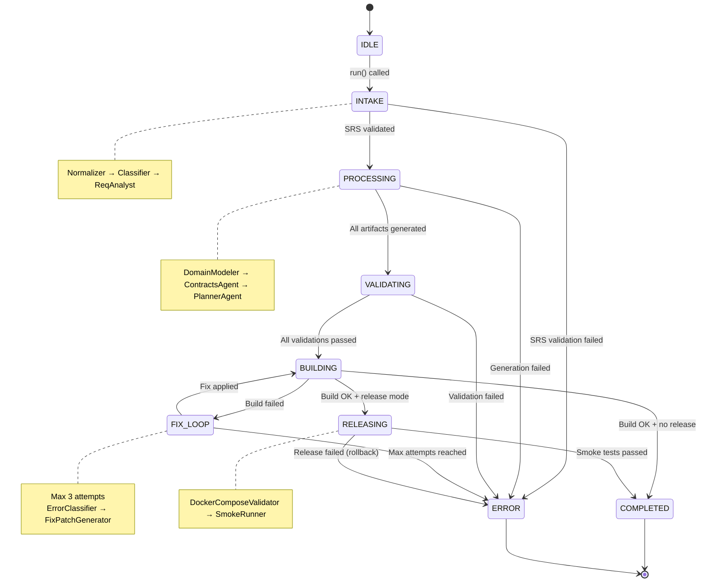
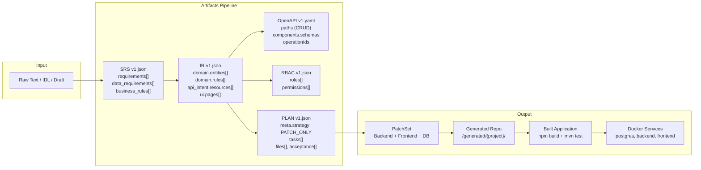
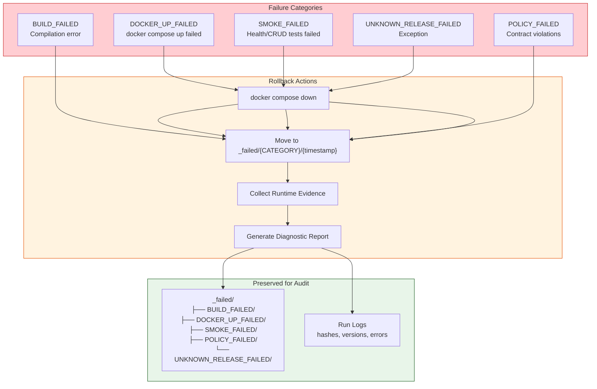
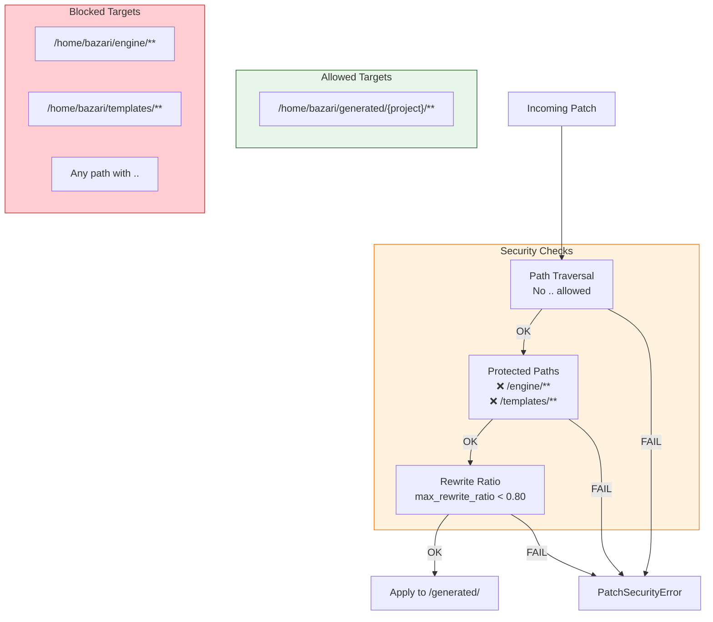

# Bazari Engine - Diagrama de Arquitetura

> **Nota sobre Compilers:** `BackendCompiler` e `FrontendCompiler` existem em `/compilers/` mas **não são usados** no pipeline v1. A geração de código usa `PatchGenerator` + sistema de `SLOT_MARKERS`.

## Fluxo Completo do Pipeline

```mermaid
flowchart TB
    subgraph ENTRY["1. ENTRY POINT"]
        CLI["main.py<br/>--project, --input, --mode"]
        CLI --> InputDispatcher
    end

    subgraph DISPATCH["2. INPUT DISPATCH"]
        InputDispatcher{"InputDispatcher<br/>detect_mode()"}
        InputDispatcher -->|"IDL (.idl)"| IDL_PATH["IDL Parser"]
        InputDispatcher -->|"Draft (JSON)"| DRAFT_PATH["GATE 1: Schema<br/>GATE 2: Compile"]
        InputDispatcher -->|"Natural (text)"| NAT_PATH["STUB blocks<br/>open_questions"]

        IDL_PATH --> IDL_STORE_SAVE["IDLStore.save()<br/>Contract Gate interno"]
        DRAFT_PATH --> IDL_STORE_SAVE
        IDL_STORE_SAVE --> IDL_DOC["IDL v1 Document"]
        NAT_PATH -->|"GATE 2 FAIL"| BLOCKED["Pipeline Blocked"]
    end

    subgraph IDL_LAYER["2.1 IDL LAYER (Detalhado)"]
        direction TB

        subgraph IDL_CONSTANTS["Constantes"]
            IDL_VER["IDL_SCHEMA_VERSION = 'idl.v1'"]
            DRAFT_VER["IDL_DRAFT_SCHEMA_VERSION = 'idl_draft.v1'"]
        end

        subgraph HASH_RULES["Hash Rules"]
            HASH_FIELDS["HASHABLE_FIELDS (7):<br/>schema_version, system, actors,<br/>entities, usecases, integrations,<br/>nonfunctional"]
            NON_HASH["NON_HASH_FIELDS (4):<br/>(código: VOLATILE_FIELDS)<br/>content_hash_sha256, timestamp,<br/>parser_version, contract_notes"]
        end

        subgraph IDL_PARSE["Parser"]
            LEXER["IDLLexer.tokenize()"]
            PARSER["IDLParser.parse()"]
            IDL_DOC_CLASS["IDLDocument"]
            LEXER --> PARSER --> IDL_DOC_CLASS
        end

        subgraph CANON["Canonização"]
            TO_HASHABLE["to_hashable_dict()"]
            COMPUTE_HASH["compute_content_hash_sha256()"]
            TO_CANONICAL["to_canonical_dict()"]
            TO_HASHABLE --> COMPUTE_HASH --> TO_CANONICAL
        end

        subgraph IDL_STORE_DETAIL["IDLStore.save()"]
            SAVE_STEPS["1. to_canonical_dict()<br/>2. _validate_contract_gate_from_dict()<br/>   └─ Recalcula hash + compara<br/>3. write JSON + MD"]
            GATE_ERR["IDLContractGateError"]
            SAVE_STEPS -->|"hash mismatch"| GATE_ERR
        end
    end

    subgraph INTAKE["3. INTAKE PHASE"]
        IDL_DOC --> Normalizer["Normalizer<br/>trim, dedupe, limit 20k"]
        Normalizer --> Classifier["BlueprintClassifier<br/>→ FORCED_GENERIC"]
        Classifier --> ReqAnalyst["RequirementsAnalyst<br/>Mini-grammar (4 forms)"]
        ReqAnalyst --> SRS_VAL["SRSValidatorGate<br/>Schema + Questions"]
        SRS_VAL -->|"OK"| SRS["SRS v1.json"]
        SRS_VAL -->|"Missing fields"| QUESTIONS["Generate Questions<br/>Block Pipeline"]
    end

    subgraph PROCESSING["4. PROCESSING PHASE"]
        SRS --> DomainModeler["DomainModeler<br/>SRS → IR"]
        DomainModeler --> IR_VAL["IR Validator<br/>+ PolicyValidator"]
        IR_VAL --> IR["IR v1.json"]

        IR --> ContractsAgent["ContractsAgent<br/>IR → OAS + RBAC"]
        ContractsAgent --> CONTRACTS_VAL["OAS/RBAC Validators<br/>+ PolicyValidator"]
        CONTRACTS_VAL --> OAS["OpenAPI v1.yaml"]
        CONTRACTS_VAL --> RBAC["RBAC v1.json"]

        IR --> PlannerAgent["PlannerAgent<br/>IR → PLAN"]
        PlannerAgent --> PLAN_VAL["PLAN Validator<br/>+ PolicyValidator"]
        PLAN_VAL --> PLAN["PLAN v1.json"]
    end

    subgraph STORE["5. ARTIFACT STORE"]
        SRS --> ArtifactStore[("ArtifactsStore<br/>store_data/{project}/")]
        IR --> ArtifactStore
        OAS --> ArtifactStore
        RBAC --> ArtifactStore
        PLAN --> ArtifactStore
        ArtifactStore --> RunLog["Run Log<br/>hashes, versions"]
    end

    subgraph REPO["6. REPO GENERATION"]
        PLAN --> RepoGen["RepoGenerator"]
        RepoGen --> Templates["Copy Templates"]
        Templates --> Backend["backend/<br/>Spring Boot"]
        Templates --> Frontend["frontend/<br/>React + Vite"]
        Templates --> DB["db/<br/>Postgres + Flyway"]
        Templates --> Docker["docker-compose.yml"]
    end

    subgraph PATCH["7. PATCH ENGINE"]
        PLAN --> PatchGen["PatchGenerator<br/>PLAN → patches<br/>(SLOT_MARKERS system)"]
        PatchGen --> PatchSet["PatchSet"]
        PatchSet --> PatchEngine["PatchEngine<br/>max_rewrite_ratio < 0.80"]
        PatchEngine -->|"Security Check"| SECURITY{"Path Valid?<br/>No engine/, templates/"}
        SECURITY -->|"OK"| APPLY["Apply Patches"]
        SECURITY -->|"BLOCKED"| SEC_ERROR["PatchSecurityError"]
        APPLY --> GenRepo["Generated Repo<br/>/generated/{project}/"]
    end

    subgraph BUILD["8. BUILD VALIDATION"]
        GenRepo --> BuildValidator["BuildValidator"]
        BuildValidator --> NPM["npm ci && npm run build<br/>(180s + 300s)"]
        BuildValidator --> MVN["mvn test<br/>(300s)"]
        NPM --> BuildReport{"BuildReport"}
        MVN --> BuildReport
        BuildReport -->|"OK"| BUILD_OK["Build Success"]
        BuildReport -->|"FAIL"| FIX_LOOP
    end

    subgraph FIXLOOP["9. FIX LOOP (Max 3)"]
        FIX_LOOP["FixLoopAgent"]
        FIX_LOOP --> ErrorClass["ErrorClassifier<br/>IMPORT, TYPE, SYNTAX..."]
        ErrorClass --> FixPatchGen["FixPatchGenerator"]
        FixPatchGen --> PatchEngine
        PatchEngine --> BuildValidator
        BuildValidator -->|"Still Failing"| ATTEMPT{"Attempt < 3?"}
        ATTEMPT -->|"Yes"| FIX_LOOP
        ATTEMPT -->|"No"| FIX_FAIL["final_status=build_failed"]
    end

    subgraph RELEASE["10. RELEASE PHASE"]
        BUILD_OK --> DockerVal["DockerComposeValidator"]
        DockerVal --> EnsureValid["ensure_valid()<br/>docker-compose.yml"]
        EnsureValid --> ValidateCtx["validate_build_contexts()<br/>Dockerfiles exist"]
        ValidateCtx --> ComposeUp["test_docker_compose_up()<br/>docker compose up -d"]
        ComposeUp --> WaitReady["wait_for_readiness()<br/>Poll 120s"]
        WaitReady --> SmokeRunner["SmokeRunner<br/>Smoke Tests"]
        SmokeRunner --> SmokeReport{"SmokeReport"}
        SmokeReport -->|"PASS"| RUNNING["✓ System Running"]
        SmokeReport -->|"FAIL"| ROLLBACK
    end

    subgraph ROLLBACK["11. ROLLBACK"]
        ROLLBACK["_rollback_release()"]
        ROLLBACK --> StopServices["docker compose down"]
        StopServices --> MoveToFailed["Move to _failed/<br/>{CATEGORY}/{timestamp}"]
        MoveToFailed --> Evidence["RuntimeEvidenceCollector<br/>Diagnostic Report"]
    end

    subgraph OUTCOMES["12. FINAL OUTCOMES"]
        RUNNING --> SUCCESS["RunResult<br/>success=True<br/>final_status=running"]
        FIX_FAIL --> FAILED["RunResult<br/>success=False<br/>final_status=build_failed"]
        Evidence --> FAILED
        BLOCKED --> FAILED
        SEC_ERROR --> FAILED
    end

    %% Styling
    classDef entry fill:#e1f5fe,stroke:#01579b
    classDef dispatch fill:#f3e5f5,stroke:#4a148c
    classDef intake fill:#e8f5e9,stroke:#1b5e20
    classDef processing fill:#fff3e0,stroke:#e65100
    classDef store fill:#fce4ec,stroke:#880e4f
    classDef repo fill:#e0f2f1,stroke:#004d40
    classDef patch fill:#fff8e1,stroke:#ff6f00
    classDef build fill:#e3f2fd,stroke:#0d47a1
    classDef fixloop fill:#ffebee,stroke:#b71c1c
    classDef release fill:#f1f8e9,stroke:#33691e
    classDef rollback fill:#ffcdd2,stroke:#c62828
    classDef outcomes fill:#e8eaf6,stroke:#1a237e

    class CLI,InputDispatcher entry
    class IDL_PATH,DRAFT_PATH,NAT_PATH,IDL_DOC,BLOCKED dispatch
    class Normalizer,Classifier,ReqAnalyst,SRS_VAL,SRS,QUESTIONS intake
    class DomainModeler,IR_VAL,IR,ContractsAgent,CONTRACTS_VAL,OAS,RBAC,PlannerAgent,PLAN_VAL,PLAN processing
    class ArtifactStore,RunLog store
    class RepoGen,Templates,Backend,Frontend,DB,Docker repo
    class PatchGen,PatchSet,PatchEngine,SECURITY,APPLY,SEC_ERROR,GenRepo patch
    class BuildValidator,NPM,MVN,BuildReport,BUILD_OK build
    class FIX_LOOP,ErrorClass,FixPatchGen,ATTEMPT,FIX_FAIL fixloop
    class DockerVal,EnsureValid,ValidateCtx,ComposeUp,WaitReady,SmokeRunner,SmokeReport,RUNNING release
    class ROLLBACK,StopServices,MoveToFailed,Evidence rollback
    class SUCCESS,FAILED outcomes
```

## Diagrama de Componentes

```mermaid
flowchart LR
    subgraph CLI["CLI Layer"]
        main["main.py"]
    end

    subgraph ORCHESTRATOR["Orchestrator Layer"]
        Engine["Engine"]
        InputDispatcher["InputDispatcher"]
        StateMachine["StateMachine"]
        ExecContext["ExecutionContext"]
    end

    subgraph INTAKE["Intake Layer"]
        Normalizer["Normalizer"]
        BlueprintClassifier["BlueprintClassifier"]
        ReqAnalyst["RequirementsAnalyst"]
    end

    subgraph AGENTS["Agent Layer"]
        DomainModeler["DomainModeler"]
        ContractsAgent["ContractsAgent"]
        PlannerAgent["PlannerAgent"]
    end

    subgraph VALIDATORS["Validator Layer"]
        SRSValidator["SRSValidator"]
        IRValidator["IRValidator"]
        OASValidator["OpenAPIValidator"]
        RBACValidator["RBACValidator"]
        PlanValidator["PlanValidator"]
        PolicyValidator["PolicyValidator"]
        BuildValidator["BuildValidator"]
    end

    subgraph GENERATORS["Generator Layer"]
        RepoGenerator["RepoGenerator"]
        PatchGenerator["PatchGenerator"]
        PatchEngine["PatchEngine"]
    end

    subgraph FIXLOOP["Fix Loop Layer"]
        FixLoopAgent["FixLoopAgent"]
        ErrorClassifier["ErrorClassifier"]
        FixPatchGenerator["FixPatchGenerator"]
    end

    subgraph RELEASE["Release Layer"]
        DockerComposeValidator["DockerComposeValidator"]
        SmokeRunner["SmokeRunner"]
        ReleaseChecklist["ReleaseChecklist"]
        DiagnosticReport["DiagnosticReport"]
    end

    subgraph STORAGE["Storage Layer"]
        ArtifactsStore["ArtifactsStore"]
        RunLog["RunLog"]
    end

    main --> Engine
    Engine --> InputDispatcher
    Engine --> StateMachine
    Engine --> ExecContext

    InputDispatcher --> Normalizer
    Normalizer --> BlueprintClassifier
    BlueprintClassifier --> ReqAnalyst

    ReqAnalyst --> DomainModeler
    DomainModeler --> ContractsAgent
    ContractsAgent --> PlannerAgent

    ReqAnalyst --> SRSValidator
    DomainModeler --> IRValidator
    ContractsAgent --> OASValidator
    ContractsAgent --> RBACValidator
    PlannerAgent --> PlanValidator

    IRValidator --> PolicyValidator
    OASValidator --> PolicyValidator
    PlanValidator --> PolicyValidator

    PlannerAgent --> RepoGenerator
    RepoGenerator --> PatchGenerator
    PatchGenerator --> PatchEngine

    PatchEngine --> BuildValidator
    BuildValidator --> FixLoopAgent
    FixLoopAgent --> ErrorClassifier
    ErrorClassifier --> FixPatchGenerator
    FixPatchGenerator --> PatchEngine

    BuildValidator --> DockerComposeValidator
    DockerComposeValidator --> SmokeRunner
    SmokeRunner --> ReleaseChecklist
    ReleaseChecklist --> DiagnosticReport

    ReqAnalyst --> ArtifactsStore
    DomainModeler --> ArtifactsStore
    ContractsAgent --> ArtifactsStore
    PlannerAgent --> ArtifactsStore
    Engine --> RunLog
```

## Diagrama de Estados

## Fluxo de Dados (Artefatos)

## Fluxo de Rollback e Falhas

## Segurança do Patch Engine

